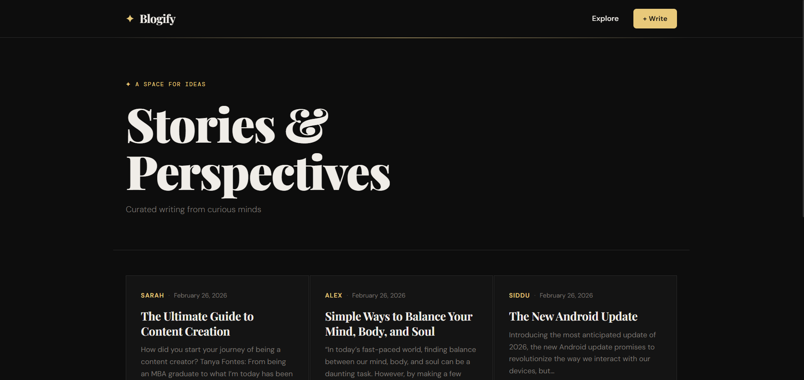
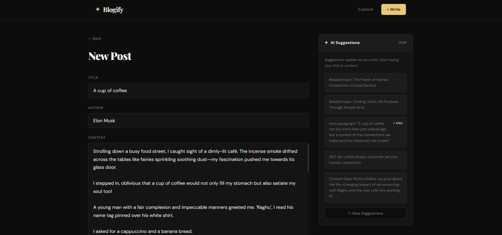

# AI-Powered Blog Platform

A modern, full-stack blog application built with React, Node.js, and SQLite, featuring intelligent integration with Groq's Llama 3 API to provide AI-assisted content suggestions while writing.

**🌍 Live Demo**: [https://aiblog-frontend.onrender.com/](https://aiblog-frontend.onrender.com/)

## Features
- **Full-Stack Architecture**: React frontend (`Vite`) and Node.js/Express backend.
- **Embedded Database**: Lightweight `better-sqlite3` database tailored for fast, local development.
- **AI Integration**: Implements the `groq-sdk` to call the `llama-3.1-8b-instant` model, providing writers with related topics, SEO tips, and content ideas via a forced JSON response mechanism.
- **Dockerized**: Fully containerized with a `docker-compose.yml` for guaranteed consistent local environments.
- **Deployment Ready**: Includes a `render.yaml` Blueprint for 1-click Infrastructure as Code deployments to Render.com.

---

## 🚀 Quick Start (Local Development)

### Prerequisites
- Node.js (v18+)
- Make sure you have a [Groq API Key](https://console.groq.com/keys).

### 1. Setup the Backend
1. Navigate to the `backend` directory:
   ```bash
   cd backend
   ```
2. Install dependencies:
   ```bash
   npm install
   ```
3. Create a `.env` file in the `backend` folder and add your key:
   ```env
   PORT=5000
   GROQ_API_KEY=gsk_your_actual_key_here
   FRONTEND_URL=http://localhost:5173
   ```
4. Start the server:
   ```bash
   node server.js
   ```

### 2. Setup the Frontend
1. Open a new terminal and navigate to the `frontend` directory:
   ```bash
   cd frontend
   ```
2. Install dependencies:
   ```bash
   npm install
   ```
3. Start the Vite development server:
   ```bash
   npm run dev
   ```
4. Visit `http://localhost:5173` in your browser.

---

## 🐳 Running with Docker

You can spin up the entire application (frontend, backend, database) with a single command using Docker.

1. Create a `backend/.env` file with your `GROQ_API_KEY`.
2. From the root of the project, run:
   ```bash
   docker compose up --build -d
   ```
3. The frontend will be available at `http://localhost`, and the backend will be internally mapped. 
   > Note: In the Docker setup, a persistent volume ensures your SQLite data survives container restarts.

---

## ☁️ Deployment (Render.com)

This project has been heavily optimized for deployment on Render's Free Tier using a **Blueprint Specification**.

### How to Deploy
1. Log in to [Render Dashboard](https://dashboard.render.com).
2. Click **New +** and select **Blueprint**.
3. Connect your fork/clone of this repository.
4. Render will prompt you for your `GROQ_API_KEY`. Paste it in.
5. Click **Apply**. 

Render will automatically provision:
- A Node **Web Service** for the backend.
- A **Static Site** for the React frontend.
- It will automatically link the backend's URL to the frontend environment.

### Deployment Notes
- **Dynamic Routing**: The frontend automatically detects its host environment (e.g., `aiblog-frontend.onrender.com`) and routes API requests safely to the associated `-backend` domain to bypass build-state sync issues.
- **Persistence Limit**: Because Render's Free Tier uses ephemeral filesystems, the SQLite database will be reset when the backend spins down (after 15 minutes of inactivity). This is expected behavior for the free tier.

---

## Technical Highlights
* **JSON Mode AI**: The backend forces the Groq LLM to return valid JSON arrays, preventing UI parsing crashes.
* **CORS Management**: The backend dynamically identifies and allows requests originating from the matched Render frontend domain, dropping standard `localhost` when deployed.

---

## 📸 Screenshots

*(Replace the placeholder links below with actual image paths once you capture them)*

### 1. Blog List Dashboard

*The main UI showing a list of all created blog posts.*

### 2. Creating a Blog Post

*The fully responsive editor for drafting new content.*

### 3. AI Suggestions in Action

*Groq's Llama 3 model providing real-time related topics and SEO tips based on the current draft.*

---

## 🗄️ Database Schema

The application uses `better-sqlite3` for a streamlined, embedded relational database. Upon initialization, it automatically creates a `blogs` table with the following schema:

| Column | Type | Constraints | Description |
| :--- | :--- | :--- | :--- |
| `id` | `INTEGER` | `PRIMARY KEY AUTOINCREMENT` | Unique identifier for the post. |
| `title` | `TEXT` | `NOT NULL` | The title of the blog post. |
| `content` | `TEXT` | `NOT NULL` | The main body of the blog post. |
| `author` | `TEXT` | `NOT NULL` | The name of the writer. |
| `created_at` | `DATETIME` | `DEFAULT CURRENT_TIMESTAMP` | Timestamp of post creation. |
| `updated_at` | `DATETIME` | `DEFAULT CURRENT_TIMESTAMP` | Timestamp of the last update. |

---

## 🤖 AI Integration Explained

The application features an "AI Suggestions" button in the blog editor. When clicked, it triggers the following workflow:

1. **Context Gathering**: The frontend bundles the current `title` and `content` of the draft.
2. **Backend Submission**: Sends a POST request to `/api/ai-suggestions`.
3. **Prompt Engineering**: The backend Node.js server constructs a strict prompt telling the Groq LLM to act as a blog assistant and provide exactly 5 suggestions (topics, SEO tips, intros).
4. **JSON Forcing**: The backend uses the `groq-sdk` with `response_format: { type: 'json_object' }` to guarantee the model uses the specified JSON schema.
5. **Rendering**: The frontend parses the returned JSON array and displays the actionable tips in the UI sidebar.

---

## 🔌 API Documentation

The backend exposes a RESTful API powered by Express.js. All endpoints are prefixed with `/api`.

### Blogs API

| Method | Endpoint | Description | Expects | Returns |
| :--- | :--- | :--- | :--- | :--- |
| `GET` | `/blogs` | Retrieve all blog posts. | - | `Array<BlogObject>` |
| `GET` | `/blogs/:id` | Retrieve a specific post by ID. | `id` in URL | `BlogObject` |
| `POST` | `/blogs` | Create a new blog post. | `{ title, content, author }` | `{ message, postId }` |
| `PUT` | `/blogs/:id` | Update an existing post. | `{ title?, content?, author? }` | `{ message }` |
| `DELETE` | `/blogs/:id` | Delete a specific post. | `id` in URL | `{ message }` |

### AI Core API

| Method | Endpoint | Description | Expects | Returns |
| :--- | :--- | :--- | :--- | :--- |
| `POST` | `/ai-suggestions` | Generate contextual writing tips based on draft. | `{ title, content }` | `{ suggestions: Array<string> }` |
